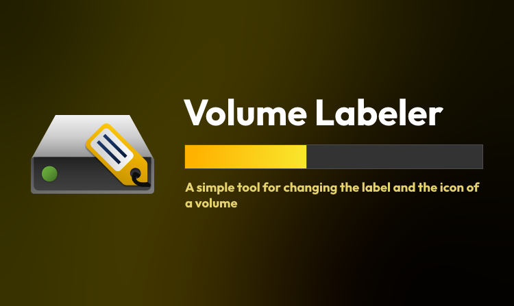
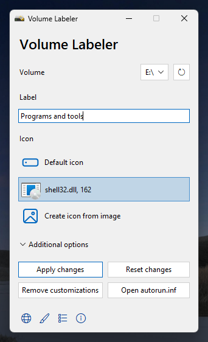
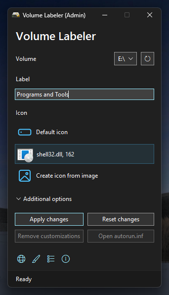

<div align="center">
    
</div>

# Volume Labeler
[](https://github.com/Valer100/Volume-Labeler/releases/latest)
[](https://github.com/Valer100/Volume-Labeler/releases)
[]()
[]()
[](https://github.com/Valer100/Volume-Labeler/actions/workflows/build.yml)
[](https://github.com/Valer100/Volume-Labeler/releases)
[](https://github.com/Valer100/Volume-Labeler/stargazers)
[](https://github.com/Valer100/Volume-Labeler/graphs/contributors)
[](https://github.com/Valer100/Volume-Labeler/commits/main)
[](https://github.com/Valer100/Volume-Labeler/commits/main)
[](https://github.com/Valer100/Volume-Labeler/blob/main/LICENSE)

A simple tool for changing the label and the icon of a volume in Windows. It makes these changes by creating an `autorun.inf` file (or edits the existing one) on the volume you want to change its label and icon. 


## ✨ Features
- When selecting a volume, it checks if `autorun.inf` is present on it. It then retrieves its actual label and icon, so you don't have to type the same label if you only want to change the volume's icon or select the same icon if you only want to change the volume's label.

- Multiple icon options: default icon, custom icon (`.ico` or from an `.exe`, `.dll` or `.icl` file) or icon from image (converts the selected image to an `.ico` file).

- Refresh volume information in the File Explorer after applying the changes (requires running the app as administrator and not using the volume; doesn't work with the system drive)

- Option to hide the `autorun.inf` file and the `vl_icon` folder (the icon is stored in that folder).

- Option to backup the `autorun.inf` file for easily restoring it later if something wents wrong or you want to revert your changes to a previous point.

- Option to get rid of all customizations (including the ones not made by Volume Labeler).

- Entry in the volumes' right click context menu for easily customizing volumes (available only in the classic context menu at the moment). 

- Light and dark themes and localization support.

## 📷 Screenshots

| ☀️ Light Mode | 🌛 Dark Mode |
|:-------------:|:------------:|
|  |  |

## ▶️ Running from source
Before running from the source, you must install the dependencies. To do that, open Command Prompt inside the cloned repository and run the following command:

```powershell
pip install -r requirements.txt
```

After that, open the `main.pyw` file.

## 🏗️ Building

### Building the app
Just run `build_app.bat`. It will do everything needed to build the app. After the build process is done, you can find the built app in a `build` folder (or in a `dist` folder if the renaming process fails).

### Building the installer
Before building the installer, you must download and install Inno Setup Compiler on your computer. You can download it [here](https://jrsoftware.org/isdl.php/).

Also, you must build the app first before building the installer. After building the app, make sure a `build` folder appears. If it doesn't and  a `dist` folder appears intstead, rename that folder to `build`. After that, right-click `build_installer_x86.iss`, `build_installer_x64.iss` or `build_installer_arm64.iss` (depending on your CPU's architecture) and choose `Compile`. After the installer was built, you can find it in the same `build` folder.

## 💿 Download
At the moment, there are no stable realeses published. However, if you want to try unstable versions, you can check out the builds from [GitHub Actions](https://github.com/Valer100/Volume-Labeler/actions).

<a href="https://github.com/Valer100/Volume-Labeler/actions#gh-light-mode-only">
    
</a>

<a href="https://github.com/Valer100/Volume-Labeler/actions#gh-dark-mode-only">
    
</a>

<!-- Click [here](https://github.com/Valer100/Volume-Labeler/releases/latest) to download the latest version. You can download either the portable or the installer version.

<a href="https://github.com/Valer100/Volume-Labeler/releases/latest#gh-light-mode-only">
    
</a>

<a href="https://github.com/Valer100/Volume-Labeler/releases/latest#gh-dark-mode-only">
    
</a>

<br>

If you want to test and get the latest features as soon as possible, you can also try the canary builds from [GitHub Actions](https://github.com/Valer100/Volume-Labeler/actions). These builds might be very unstable.

<a href="https://github.com/Valer100/Volume-Labeler/actions#gh-light-mode-only">
    
</a>

<a href="https://github.com/Valer100/Volume-Labeler/actions#gh-dark-mode-only">
    
</a> -->

## 📜 License
Volume Labeler is MIT-licensed. You can read the license text [here](https://github.com/Valer100/Volume-Labeler/blob/main/LICENSE).
